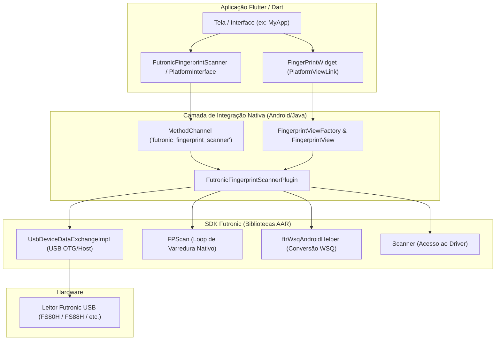

# Futronic Fingerprint Scanner (Flutter Plugin)

Plugin Flutter para integração e captura biométrica utilizando leitores de impressão digital USB da **Futronic** (como FS80H, FS88H, FS26, entre outros) em dispositivos Android via **USB Host (OTG)**.

---

## 📋 Sumário

- [Visão Geral](#-visão-geral)
- [Funcionalidades](#-funcionalidades)
- [Arquitetura do Projeto](#-arquitetura-do-projeto)
- [Versões e Tecnologias](#-versões-e-tecnologias)
- [Configuração de Ambiente](#-configuração-de-ambiente)
- [Instalação e Permissões](#-instalação-e-permissões)
- [Como Executar o Exemplo](#-como-executar-o-exemplo)
- [Guia de Uso na Aplicação](#-guia-de-uso-na-aplicação)
- [Anotações Técnicas e Solução de Problemas](#-anotações-técnicas-e-solução-de-problemas)

---

## 🔍 Visão Geral

O `futronic_fingerprint_scanner` encapsula a biblioteca nativa Android (AAR/SDK) da Futronic, permitindo comunicação direta com leitores biométricos conectados à porta USB de smartphones e tablets Android. 

Ele disponibiliza canais bidirecionais (`MethodChannel`) para comandos de controle (iniciar escaneamento, parar, alterar configurações de captura e salvar imagens) e uma `PlatformView` nativa para exibição em tempo real do stream de imagem da digital.

---

## ⚡ Funcionalidades

- **Visualização em Tempo Real**: Widget nativo Flutter (`FingerPrintWidget`) que renderiza a imagem da digital diretamente via `PlatformView` com alta taxa de atualização.
- **Detecção de Dedo Vivo (LFD - Live Finger Detection)**: Suporte a filtro anti-fraude para detecção de dedos falsos.
- **Inversão de Cores**: Opção para inverter as cores da imagem da digital capturada.
- **Cálculo NFIQ**: Suporte ao cálculo de métrica de qualidade da digital (NIST Fingerprint Image Quality).
- **Exportação de Imagens**:
  - **BITMAP (`.bmp`)**: Imagem padrão de alta resolução.
  - **WSQ (`.wsq`)**: Formato de compressão wavelet certificado pelo FBI, padrão para identificação biométrica policial/civil.
- **Captura de Bytes em Memória**: Obtenção do array de bytes brutos (`Uint8List`) da imagem para validação ou envio a servidores.
- **Gerenciamento de Ciclo de Vida**: Tratamento de reanexação de Activity, prevenindo crashes de ponteiros nulos (`NullPointerException`).

---

## 🏗 Arquitetura do Projeto

O projeto é estruturado no modelo de plugin federado/híbrido do Flutter:



### Estrutura de Diretórios:

```text
futronic_fingerprint_scanner/
├── android/                                # Código nativo Android da biblioteca
│   ├── build.gradle                        # Configurações Gradle da lib (compileSdk 34, Java 17)
│   ├── ftrScanApiAndroidHelperUsbHost-release/  # AAR nativo da Futronic (USB Host)
│   ├── ftrWsqAndroidHelper-release/        # AAR nativo da Futronic (Algoritmo WSQ)
│   └── src/main/java/                      # Classes Java de integração e PlatformView
├── lib/                                    # Código público da biblioteca Dart
│   ├── fingerprint_widget.dart             # Widget de visualização da digital
│   ├── futronic_fingerprint_scanner.dart   # Ponto de entrada do plugin e eventos
│   ├── futronic_fingerprint_scanner_method_channel.dart  # Implementação dos MethodChannels
│   └── futronic_fingerprint_scanner_platform_interface.dart
└── example/                                # Aplicativo de demonstração e testes
    ├── android/                            # Configuração moderna Gradle 9 / AGP 9
    └── lib/main.dart                       # Exemplo prático de uso de todos os recursos
```

---

## 🛠 Versões e Tecnologias

O projeto foi atualizado e validado com o ecossistema moderno do Flutter e Android:

| Componente | Versão Adotada | Observações |
| :--- | :--- | :--- |
| **Flutter SDK** | `>= 3.24.x` / `3.44.x` | Compatível com o motor Impeller e Dart 3 |
| **Dart SDK** | `>= 2.18.1 < 4.0.0` | Suporte a null-safety |
| **Gradle** | `9.1.0` | Configurado em `gradle-wrapper.properties` |
| **Android Gradle Plugin (AGP)** | `9.0.1` | Sintaxe declarativa moderna de plugins |
| **Kotlin Gradle Plugin** | `2.3.20` | Gerenciamento via `settings.gradle` |
| **Java JDK** | `Java 17` | `sourceCompatibility` e `targetCompatibility` |
| **Android Compile SDK** | `34` | Exigido pelas dependências modernas do AndroidX |
| **Android Target SDK** | `33` | *Ver detalhes importantes na seção de Notas Técnicas* |
| **Android Min SDK** | `16` / `21` | Suporta dispositivos legados e modernos |

---

## 📱 Configuração de Ambiente

### Pré-requisitos de Hardware
1. **Smartphone ou Tablet Android** com suporte a **USB OTG (USB Host)**.
2. **Cabo Adaptador OTG** (USB-A para USB-C ou Micro-USB).
3. **Leitor Biométrico Futronic USB** (FS80H, FS88H, FS26, etc.).

### Pré-requisitos de Software
- Flutter SDK instalado (`flutter doctor` sem erros).
- Android SDK instalado com plataformas 33 e 34.
- JDK 17 configurado no ambiente (`JAVA_HOME`).

---

## ⚙️ Instalação e Permissões

### 1. Adicionar Dependência
No arquivo `pubspec.yaml` do seu aplicativo:

```yaml
dependencies:
  flutter:
    sdk: flutter
  futronic_fingerprint_scanner:
    path: /caminho/para/futronic_fingerprint_scanner # ou repositório git
```

### 2. Permissões no `AndroidManifest.xml`
Adicione as permissões de hardware USB e armazenamento externo no seu `android/app/src/main/AndroidManifest.xml`:

```xml
<manifest xmlns:android="http://schemas.android.com/apk/res/android">

    <!-- Permissões para uso do Leitor USB -->
    <uses-feature android:name="android.hardware.usb.host" android:required="true" />
    <uses-permission android:name="android.permission.USB_PERMISSION" />
    
    <!-- Permissão opcional caso queira salvar imagens no armazenamento -->
    <uses-permission android:name="android.permission.WRITE_EXTERNAL_STORAGE" />
    <uses-permission android:name="android.permission.READ_EXTERNAL_STORAGE" />

    <application ...>
        ...
    </application>
</manifest>
```

---

## 🚀 Como Executar o Exemplo

1. Conecte o seu smartphone Android ao computador via cabo com a **Depuração USB** ativada.
2. Acesse o diretório do exemplo:
   ```bash
   cd example
   ```
3. Baixe as dependências:
   ```bash
   flutter pub get
   ```
4. Conecte o leitor biométrico Futronic no smartphone usando o adaptador OTG.
5. Inicie a execução:
   ```bash
   flutter run
   ```
6. Ao abrir o aplicativo, toque em **Start Scan**. O Android exibirá uma caixa de diálogo perguntando se permite o acesso ao dispositivo USB. Toque em **Permitir**.
7. Posicione o dedo sobre o leitor. A imagem da digital será transmitida em tempo real na tela.

---

## 💡 Guia de Uso na Aplicação

### Inicialização e Eventos

```dart
import 'package:flutter/material.dart';
import 'package:futronic_fingerprint_scanner/futronic_fingerprint_scanner.dart';
import 'package:futronic_fingerprint_scanner/fingerprint_widget.dart';

class ScannerScreen extends StatefulWidget {
  const ScannerScreen({super.key});

  @override
  State<ScannerScreen> createState() => _ScannerScreenState();
}

class _ScannerScreenState extends State<ScannerScreen> {
  final _scanner = FutronicFingerprintScanner();
  String statusMessage = 'Aguardando início...';
  bool isScanning = false;

  @override
  void initState() {
    super.initState();
    // Escutar mensagens de status e erros emitidos pelo leitor nativo
    _scanner.onMessage = (msg) {
      setState(() {
        statusMessage = msg;
      });
    };
  }

  Future<void> startCapture() async {
    final success = await _scanner.methods.scan() ?? false;
    setState(() {
      isScanning = success;
    });
  }

  Future<void> stopCapture() async {
    await _scanner.methods.stop();
    setState(() {
      isScanning = false;
    });
  }

  @override
  Widget build(BuildContext context) {
    return Scaffold(
      appBar: AppBar(title: const Text('Futronic Scanner')),
      body: Column(
        children: [
          // Widget nativo onde o leitor desenha a digital capturada
          Expanded(
            child: Center(
              child: AspectRatio(
                aspectRatio: 9 / 13,
                child: const FingerPrintWidget(),
              ),
            ),
          ),
          Padding(
            padding: const EdgeInsets.all(8.0),
            child: Text(statusMessage),
          ),
          Row(
            mainAxisAlignment: MainAxisAlignment.center,
            children: [
              ElevatedButton(
                onPressed: isScanning ? null : startCapture,
                child: const Text('Iniciar'),
              ),
              const SizedBox(width: 16),
              ElevatedButton(
                onPressed: isScanning ? stopCapture : null,
                child: const Text('Parar'),
              ),
            ],
          ),
        ],
      ),
    );
  }
}
```

### Salvando Imagens (BMP ou WSQ)

```dart
import 'package:path_provider/path_provider.dart';

Future<void> saveFingerprint() async {
  final dir = await getApplicationDocumentsDirectory();
  
  // Salvar em formato Bitmap (.bmp)
  await _scanner.methods.saveImage(
    FileFormat.bitmap,
    dir.path,
    '/digital_capturada.bmp',
  );

  // Ou salvar compactado em formato WSQ (.wsq)
  await _scanner.methods.saveImage(
    FileFormat.wsq,
    dir.path,
    '/digital_capturada.wsq',
  );
}
```

---

## 📌 Anotações Técnicas e Solução de Problemas

### 1. Requisito de `targetSdkVersion: 33` (Android 14 PendingIntent)
- **Causa**: O SDK AAR fechado fornecido pela Futronic (`ftrScanApiAndroidHelperUsbHost-release.aar`) instancia internamente um `PendingIntent` sem a flag explícita `FLAG_MUTABLE` / `FLAG_IMMUTABLE`. 
- **Efeito no Android 14+**: A partir do Android 14 (`targetSdkVersion 34`), o sistema lança `java.lang.IllegalArgumentException` por violação das novas políticas de segurança para `PendingIntent`.
- **Solução implementada**: O app de exemplo utiliza `targetSdkVersion 33`, o que garante retrocompatibilidade e permite a execução fluida em qualquer versão do Android (incluindo Android 14 e 15).
- **Produção Google Play**: Caso precise submeter para a Google Play com `targetSdk 34`, solicite um AAR atualizado diretamente à Futronic ou realize o patch das classes do AAR.

### 2. Aumento de Memória no Gradle (`OutOfMemoryError`)
- A transformação Jetifier e a montagem das bibliotecas AAR requerem memória adicional. O arquivo `example/android/gradle.properties` foi configurado com:
  ```properties
  org.gradle.jvmargs=-Xmx4G -XX:MaxMetaspaceSize=2G -XX:ReservedCodeCacheSize=512m
  ```

### 3. Tratamento de Ciclo de Vida do Flutter
- O plugin conta com proteção contra `NullPointerException` ao rotacionar a tela ou disparar *Hot Reload* / *Hot Restart*, reinstanciando automaticamente a conexão USB nativa (`UsbDeviceDataExchangeImpl`).

---

## 📄 Licença

Este projeto é disponibilizado para fins educacionais e de integração de dispositivos biométricos Futronic com a plataforma Flutter. Consulte os termos de licença dos SDKs proprietários fornecidos pela [Futronic Technology Company Limited](http://www.futronic-tech.com/).
